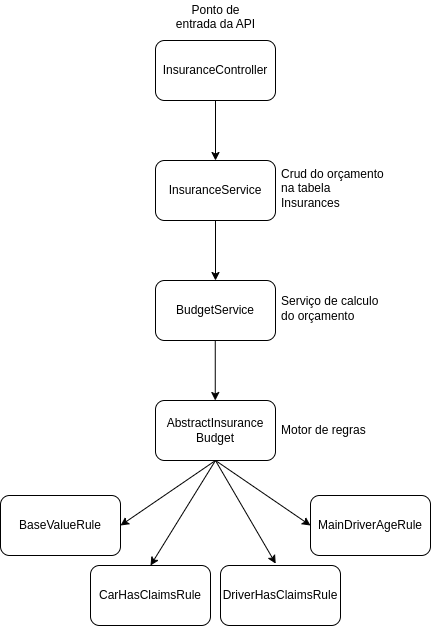
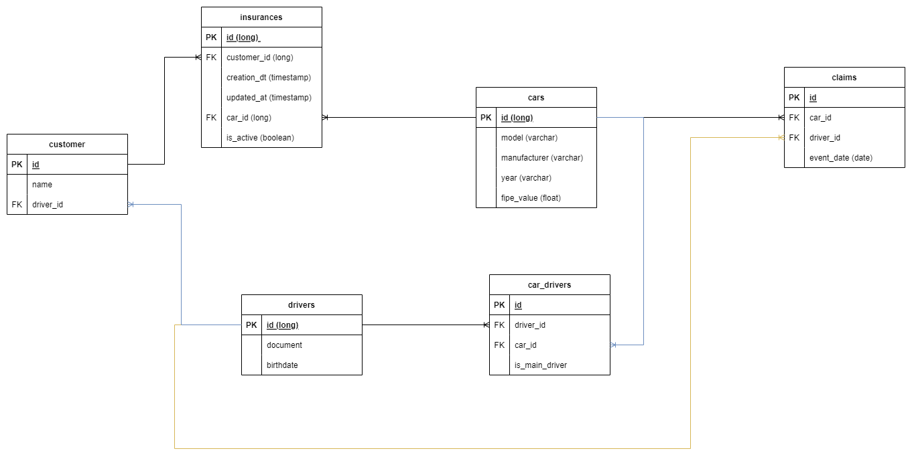

# Desafio Audsat - API para seguros 🌱🚀

Desafio para vaga de desenvolvedor Java na Audsat.

Nesse projeto utilizei como principal design pattern o [Chain of Responsibility](https://refactoring.guru/pt-br/design-patterns/chain-of-responsibility) 
para a criação do motor das regras de negócio.

## Pré-requisitos

Antes de começar, certifique-se de ter o Docker instalado em sua máquina. Você pode baixá-lo [aqui](https://www.docker.com/get-started).

## Passos para Executar a Aplicação

Siga os passos abaixo para executar a aplicação com Docker:

1. **Compilando o Projeto**

   Para compilar e criar o arquivo JAR da aplicação, execute o seguinte comando:

   ```bash
   ./gradlew bootjar

2. **Construindo a Imagem Docker**

   Em seguida, construa a imagem Docker da sua aplicação com o seguinte comando:

   ```bash
   docker-compose build

3. **Iniciando a Aplicação com Docker**

   Por fim, inicie a aplicação em um contêiner Docker com o comando:

   ```bash
    docker-compose up

## Acessando a Aplicação

Após a execução dos passos acima você pode acessar a API e a sua documentação pelo Swagger no endpoint:
http://localhost:8080/swagger-ui/index.html

## Fluxo da Aplicação


## Modelagem dos dados
